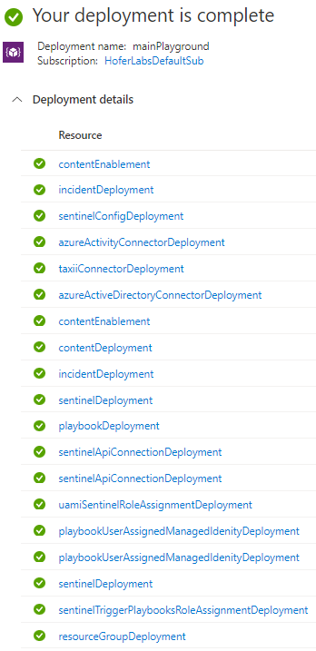
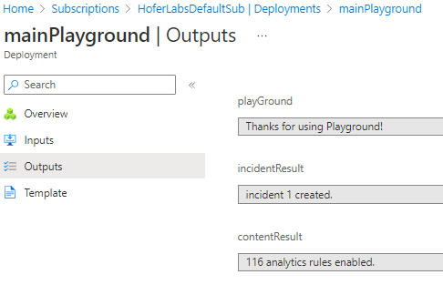

# Intro
Sentinel Playground is a project that aims to speed up deployment and configuration tasks of a Sentinel Lab/Demo environment, including sample content and Bicep Templates. This project seeks to use Bicep only.

## Feedback / Contributions / Bugs / Feature requests
Everyone is welcome to contribute / provide feedback / request features / report bugs / whatever -> create an issue or contact me directly: https://www.linkedin.com/in/andrea-hofer-ch/

Related blog post: https://hoferlabs.ch/2023/04/25/Sentinel-Playground-Bicep-Edition/


# Sentinel Playground - **Bicep Edition**
## Overview
The following components can be deployed/configured:
- Resource group
- Log Analytics workspace + Sentinel solution
- Log Analytics workspace config (retention, daily cap)
- Sentinel config (UEBA, Anomalies)
- Sentinel data connectors
    - Azure Activity
    - Azure Active Directory
    - Defender 365 incidents
- Demo playbook (with a user-assigned Managed Identity + required permissions)
- Sentinel permissions to trigger playbooks
- Sentinel Content (including Bicep templates)
    - Analytics rule
    - Automation rule
    - Log query (in a query pack)
    - Log functions
    - Watchlist (with CSV-support)
- all analytics rules for Azure Activity and Azure Active Directory are enabled

## Preparation
- make sure that you have the resource provider microsoft.insights registered (subscription -> resource providers)
- make sure that you have less than 5 aad diagnostic settings configured (5 is max)
- if you need to build ARM from Bicep: az bicep module installed (check with `az bicep --help`, inlcluded in newer az releases)
- if you need to edit Bicep files: [vsc](https://code.visualstudio.com/) with the [official bicep extension](https://marketplace.visualstudio.com/items?itemName=ms-azuretools.vscode-bicep)
## Deployment
### using ARM / UI wizard **[recommended]**
[](https://portal.azure.com/#create/Microsoft.Template/uri/https%3A%2F%2Fraw.githubusercontent.com%2Fhoferandrea%2FSentinel-Playground-Bicep-Edition%2Fmain%2FmainPlayground.json/createUIDefinitionUri/https%3A%2F%2Fraw.githubusercontent.com%2Fhoferandrea%2FSentinel-Playground-Bicep-Edition%2Fmain%2FmainPlaygroundUi.json)

### using CLI / Powershell

Download the latest release (on the right)

and deploy either with default parameters (laName=la-sentinel-playground-01, rgName=rg-sentinel-playground-01)
```
az deployment sub create --template-file .\mainPlayground.bicep --location switzerlandnorth
```
or  with custom parameters:
- **rgName:** resource group name *-> rg-sentinel-playground-01*
- **laName:** log analytics workspace name *-> la-sentinel-playground-01*
- **uamiName:** name of the user-assigned managed identity (used in playbook) *-> mi-sentinel-playbooks*
- **laRetentionDays:** log analytics workspace retention in days *-> 30*
- **laDailyCapGb:** log analytics workspace daily cap in GB (only integers are supported) *-> 1*

-> check the heading of the Bicep File for more parameters as more are added in the future.
```
az deployment sub create --template-file .\mainPlayground.bicep --location switzerlandnorth --parameters rgName=rg-sentinel-playground-01 laName=la-sentinel-playground-01 uamiName=mi-sentinel-playbooks laRetentionDays=30 laDailyCapGb=1
```


to check progress: go to your subscription -> depyloments -> mainPlayground:






## Post deployment checks
- create a new incident, trigger the playbook "la-sentinel-addCommentToIncident" -> check if comment is added
- check data connectors (should take ~10min until events are received)
- check sentinel config (UEBA, anomalies)

## Update the infra
Change code/parameters (e.g. log analytics retention days), redeploy with the same commands as in previous deployment -> the infra gets updated.

Check the "FAQ / limitations / bugs" chapter, as there is a known bug while reapplying  the EntitiyAnalystics config.

## Useful commands
delete created resource group (with all resources in it)
```
az group delete --name rg-sentinel-playground-01 --yes
```

show existing diagnostic setting for azure activity
```
az monitor diagnostic-settings subscription list
```

delete existing diagnostic setting for azure activity
```
az monitor diagnostic-settings subscription delete --name subscriptionToLa
```
build arm from bicep (not really needed)
```
az bicep build --file .\sentinelInfra\mainInfra.bicep
```

## FAQ / limitations / bugs
- If you rerun the deployment (to update the infra), the deployment of the sentinel config EntitiyAnalystics resource fails with "Bad Request: Update request should provide ETag". Other resources get updated. This is a known API issue: https://github.com/Azure/bicep/issues/9206 (https://github.com/Azure/bicep/issues/5256 / https://techcommunity.microsoft.com/t5/azure-observability/update-saved-search/m-p/328553). 

# Credits
- Enable Content / Analytics Rules: I modified the script from [Javier Soriano
](https://github.com/javiersoriano/sentinel-all-in-one/blob/master/ARMTemplates/Scripts/EnableRules.ps1) to allow redployments. 
